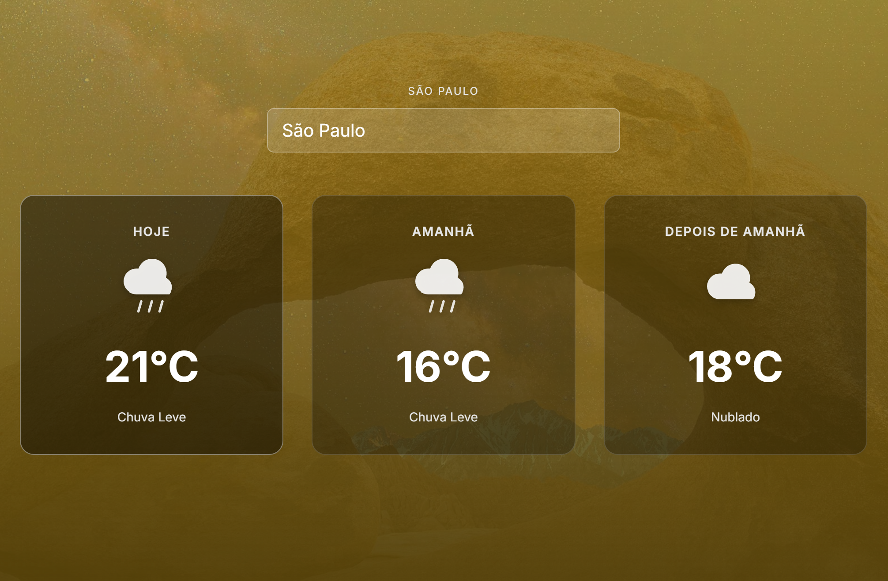

# HURB Weather Microsite

Microsite responsivo de previsão do tempo desenvolvido como desafio técnico para a **HURB**.

A aplicação exibe a previsão para os próximos 3 dias (hoje, amanhã e depois de amanhã), com geolocalização automática, imagem de fundo do Bing e degradê dinâmico baseado na temperatura.



---

## Funcionalidades

- **Geolocalização automática** — detecta a cidade ao abrir a página via API do navegador + reverse geocode (OpenCage)
- **Busca manual** — campo de texto para trocar a localidade (confirmar com Enter ou ao sair do campo)
- **Previsão de 3 dias** — hoje, amanhã e depois de amanhã com temperatura, descrição e ícone
- **Toggle °C / °F** — clique em qualquer temperatura para alternar a unidade em todos os cards
- **Fundo dinâmico** — imagem do dia do Bing com degradê de cor conforme temperatura:
  - Azul — abaixo de 15 °C
  - Amarelo — entre 15 °C e 35 °C
  - Vermelho — acima de 35 °C
- **Responsivo** — mobile-first, adaptado para 375 px até 1280 px+

---

## Stack

| Camada | Tecnologia |
|--------|-----------|
| Framework | Next.js 16 (App Router) + TypeScript 5 |
| Estilo | CSS Modules + CSS Variables |
| Testes unitários / integração | Jest + Testing Library + MSW |
| Testes E2E | Playwright |
| Container | Docker multi-stage (development + production) |

### APIs

| API | Endpoint | Uso |
|-----|----------|-----|
| [OpenWeather Forecast 2.5](https://openweathermap.org/forecast5) | `/data/2.5/forecast?q=` ou `?lat=&lon=` | Previsão de 5 dias (extrai 3) |
| [OpenCage](https://opencagedata.com/api) | `/geocode/v1/json?q={lat},{lng}` | Reverse geocode → nome da cidade |
| [Bing Image](https://www.bing.com/HPImageArchive.aspx) | `/api/bing-image` *(proxy local)* | Imagem de fundo do dia |

> **Bing:** chamadas diretas do browser são bloqueadas por CORS. A aplicação usa uma Route Handler do Next.js (`/api/bing-image`) como proxy server-side com cache de 1h.

---

## Pré-requisitos

- [Docker](https://www.docker.com/) 24+ e Docker Compose 2+ (recomendado)
- **Ou** Node.js 20+ e npm 10+ (execução local)
- Chaves de API:
  - [OpenWeather](https://openweathermap.org/api) — gratuita
  - [OpenCage](https://opencagedata.com/) — gratuita (2 500 req/dia)

---

## Configuração

```bash
# Copiar o template de variáveis de ambiente
cp .env.example .env.local

# Editar .env.local com suas chaves reais
# NEXT_PUBLIC_OPENWEATHER_APPID=sua_chave
# NEXT_PUBLIC_OPENCAGE_API_KEY=sua_chave
```

---

## Executar com Docker (recomendado)

### Desenvolvimento (hot reload)

```bash
docker compose --profile dev up
```

Acesse: [http://localhost:3000](http://localhost:3000)

### Produção (build otimizado)

```bash
docker compose --profile prod up --build
```

Para rebuild sem cache:

```bash
docker compose build --no-cache
```

---

## Executar localmente (sem Docker)

```bash
npm install
npm run dev
```

Acesse: [http://localhost:3000](http://localhost:3000)

Build de produção:

```bash
npm run build
npm start
```

---

## Testes

### Unitários e de integração (Jest + Testing Library + MSW)

```bash
# Executar todos os testes
npm run test

# Com relatório de cobertura
npm run test:coverage

# Modo watch (re-executa ao salvar)
npm run test -- --watch
```

### E2E (Playwright)

```bash
# Executar testes E2E (inicia o servidor automaticamente)
npm run test:e2e

# Com interface visual do Playwright
npm run test:e2e -- --ui

# Com browser visível
npm run test:e2e -- --headed
```

> Os testes E2E mockam as APIs via `page.route()` e a geolocalização via `context.setGeolocation()` — não são necessárias chaves reais para rodar os testes.

### Lint

```bash
npm run lint
```

---

## Variáveis de Ambiente

| Variável | Descrição | Obrigatória |
|----------|-----------|-------------|
| `NEXT_PUBLIC_OPENWEATHER_APPID` | Chave da API OpenWeather | ✅ |
| `NEXT_PUBLIC_OPENCAGE_API_KEY` | Chave da API OpenCage | ✅ |

Referência: [`.env.example`](./.env.example)

> As chaves com prefixo `NEXT_PUBLIC_` são expostas ao client-side. Ambas as APIs têm planos gratuitos e não expõem dados sensíveis do servidor.

---

## Estrutura do Projeto

```
src/
├── app/                    → Rotas Next.js (App Router)
│   ├── layout.tsx          → Layout raiz (Inter font, metadata)
│   ├── page.tsx            → Página principal
│   └── globals.css         → Reset CSS + import de tokens
├── components/             → Componentes de UI reutilizáveis
│   ├── BackgroundImage/    → Imagem fullscreen + overlay de gradiente
│   ├── ErrorMessage/       → Mensagem de erro com botão retry
│   ├── LoadingState/       → Skeletons com shimmer animation
│   ├── LocationInput/      → Input de busca de localidade
│   ├── WeatherCard/        → Card de previsão de um dia
│   └── WeatherGrid/        → Grid responsivo com 3 WeatherCards
├── hooks/                  → Custom hooks
│   ├── useGeolocation.ts   → Wrapper para navigator.geolocation (com retry)
│   ├── useTemperatureUnit.ts → Toggle °C / °F
│   └── useWeather.ts       → Orquestrador: geo → (reverseGeocode + byCoords + Bing) em paralelo
├── services/               → Chamadas às APIs externas
│   ├── bing.ts             → Imagem diária do Bing (via proxy /api/bing-image)
│   ├── opencage.ts         → Reverse geocode (lat/lon → nome da cidade)
│   └── openweather.ts      → getWeatherForecast(city) + getWeatherForecastByCoords(lat, lon)
├── app/api/
│   └── bing-image/route.ts → Proxy server-side para a API do Bing (CORS)
├── styles/
│   └── tokens.css          → CSS Variables: gradientes, tipografia, espaçamento
├── types/                  → Interfaces TypeScript
└── utils/                  → Funções puras (temperatura, gradiente, ícones, data)
public/
└── icons/                  → Ícones SVG de condições climáticas
tests/
└── e2e/                    → Testes Playwright
```

---

## Decisões Técnicas

### CSS Modules em vez de Tailwind
Seguindo a especificação do desafio. CSS Variables no `tokens.css` garantem consistência sem framework externo.

### Ícones SVG customizados
Criados com estilo "branco sobre transparente" para se integrar com os fundos de degradê escuros. Versionados no repositório, sem dependência de binários externos.

### Mocks MSW no cliente
Os testes de serviços usam `jest.fn()` diretamente (sem MSW) pois os serviços são simples wrappers de `fetch`. Os testes de hooks usam `jest.mock` nos módulos de serviço. Isso evita problemas de compatibilidade ESM com dependências transitivas do MSW em ambientes Jest.

### Timezone no `extractThreeDayForecast`
A API retorna timestamps Unix. O agrupamento por dia usa componentes locais da data (`.getFullYear()`, `.getDate()`) em vez de `.toISOString()` para evitar que fusos negativos (ex: UTC-3) causem shift de data.

### Bing via proxy server-side
A API do Bing não inclui `Access-Control-Allow-Origin`, bloqueando chamadas diretas do browser. A Route Handler `/api/bing-image` faz a requisição no servidor e repassa o resultado, com `next: { revalidate: 3600 }` para cache de 1h.

### Retry de geolocalização
O hook `useWeather` expõe `retryGeolocation()` que incrementa um contador de tentativas. Como `useGeolocation` recebe esse contador como dependência do `useEffect`, incrementá-lo re-dispara a chamada à API de geolocalização sem recarregar a página.

### Duas funções de previsão
`getWeatherForecast(cityName)` usa `q=` para busca por nome (caso de busca manual). `getWeatherForecastByCoords(lat, lon)` usa `lat=&lon=` para busca por coordenadas (caso de geolocalização automática) — evita um round-trip extra de reverse geocoding.

---

## Documentação adicional

- [`docs/CHALLENGE.md`](./docs/CHALLENGE.md) — Especificação completa do desafio
- [`docs/MELHORIAS.md`](./docs/MELHORIAS.md) — Melhorias propostas ao layout original
- [`CHANGELOG.md`](./CHANGELOG.md) — Histórico de versões
